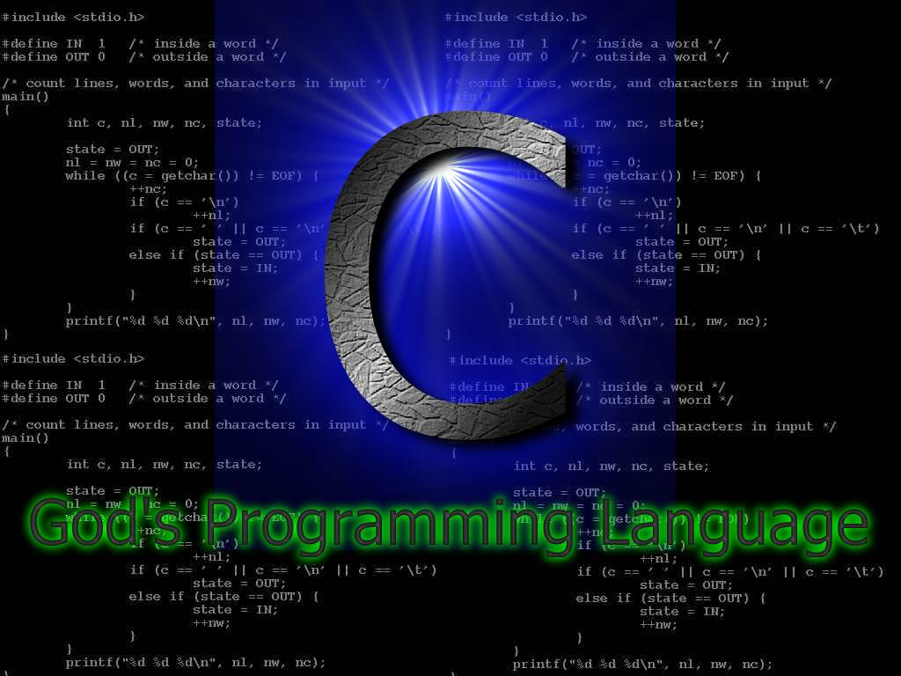

##C语言的前世今生

关于C语言的历史，我这里不再赘述，从网上找到了一篇比较完备的文字。关于C语言的历史与背景故事，强力推荐《C和指针》，《C专家编程》，《UNIX 编程艺术》。

###概述
C语言是从BCPL发展而来的。BCPL语言是在CPL基础之上简化而来的，于1967年在剑桥大学诞生。
取BCPL的首字母B 而设计出来的语言B语言。第一个unix系统就是用B语言写的。 这一切都发生在伟大的贝尔实验室。

###C的前世

BCPL 这是一款汇编语言，在汤普森和理查德编写UNIX时修改后成了新的语言----C。

###C的今生

在1972年，美国贝尔实验室的 D.M.Ritchie 在B语言的基础上最终设计出了一种新的语言，他取了BCPL的第二个字母作为这种语言的名字，这就是C语言。

《可移植的C语言编译程序》的发布，推广了unix系统，于1978年，C语言正式发布，同时著名的书籍《The C Programming Language》发布。在之后，ANSI 在这本书的基础上制定了C语言标准。

于1990年， ISO接受了 C 为I SO C 的标准（ISO9899-1990）。并于1994年，修订了C语言标准。5年之后， ISO对前版本做了修改，此次也修改了C语言的标准，增加了一些需要的功能。于 2001与2004，这两年发生了 两次技术修改。

目前流行的C语言编译系统大多是以ANSI C为基础进行开发的，但不同版本的C编译系统所实现的语言功能和语法规则又略有差别。

###C语言的特点

C是中级语言。它把高级语言的基本结构和语句与低级语言的实用性结合起来。

C 语言可以像汇编语言一样对位、字节和地址进行操作， 而这三者是计算机最基本的工作单元；

C是结构式语言。结构式语言的显著特点是代码及数据的分隔化，即程序的各个部分除了必要的信息交流外彼此独立。这种结构化方式可使程序层次清晰，便于使用、维护以及调试。C 语言是以函数形式提供给用户的，这些函数可方便的调用，并具有多种循环、条件语句控制程序流向，从而使程序完全结构化；

C语言功能齐全。具有各种各样的数据类型，并引入了指针概念，可使程序效率更高。

C语言具有绘图能力强，可移植性，并具备很强的数据处理能力，因此适于编写系统软件、三维、二维图形和动画，支持多种显示器和驱动器；C语言适用范围大。适合于多种操作系统，Windows、DOS、UNIX等等；也适用于多种机型。 

###C语言的缺点
C语言它的最大的缺点就是，如果你的项目很复杂，大量的开发人员互相之间需要更新大段代码时，

C语言可能会使事情变得异常麻烦。因为C是在面向对象方法流行之前开发的，这大大降低了C语言复杂设计的可能性。（不要以为C语言做不了大项目 - -世界上有太多的经典都是用C语言完成的，如果你想了解C语言的能力，不妨看看QUAKE3的源代码——很敬佩ID的无私，这份代码完全是公开的，任何人都可以使用它与修改它。）；

输入输出相对很多语言都较为复杂。对于字符串的处理，只能通过字符数组实现。绘图操作较为复杂；

C语言的缺点主要表现在数据的封装性上，这一点使得C在数据的安全性上有很大缺陷，这也是C和C++的一大区别；

C语言的语法限制不太严格，对变量的类型约束不严格，影响程序的安全性，对数组下标越界不作检查等。从应用的角度，C语言比其他高级语言较难掌握；

指针是C语言的一大特色，可以说是C语言优于其它高级语言的一个重要原因。就是因为它有指针，可以直接进行靠近硬件的操作，但是C的指针操作也给它带来了很多不安全的因素。C++在这方面做了很好的改进，在保留了指针操作的同时又增强了安全性。Java取消了指针操作，提高了安全性；
类型检查机制相对较弱、缺少支持代码重用的语言结构。

###C语言无所不能，只是我们的能力还不够！